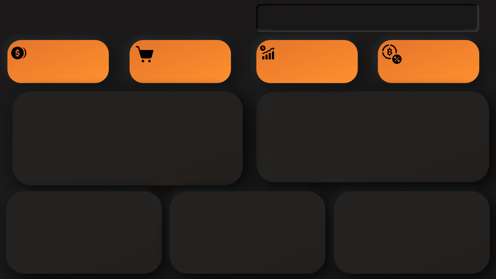
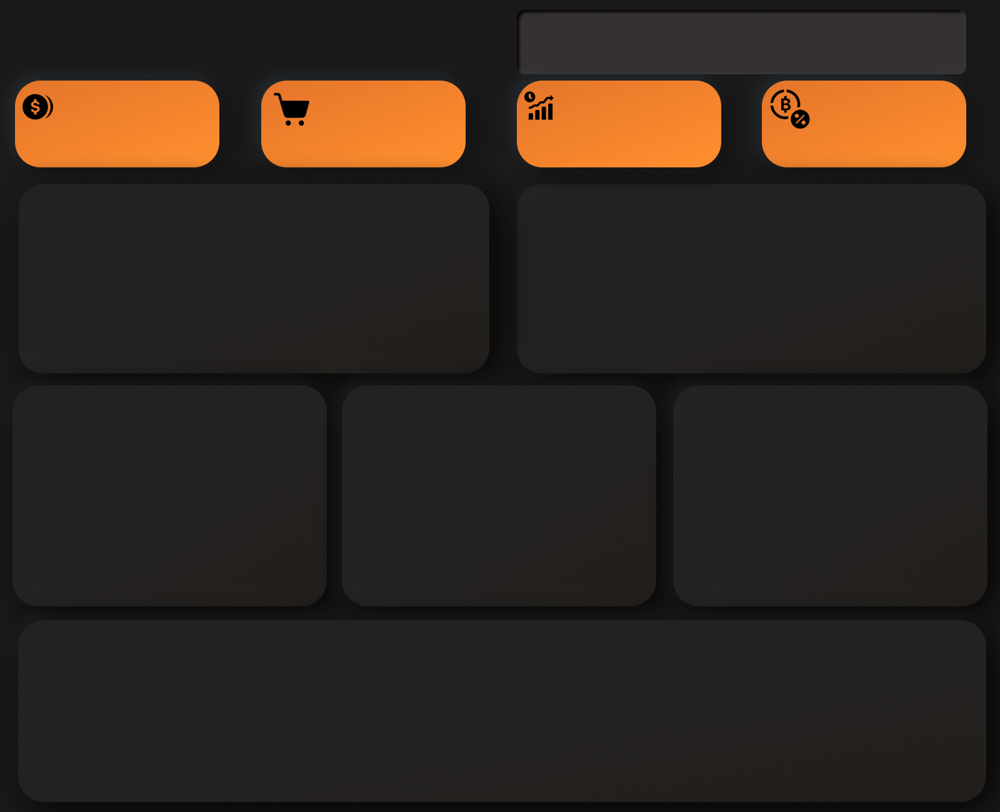
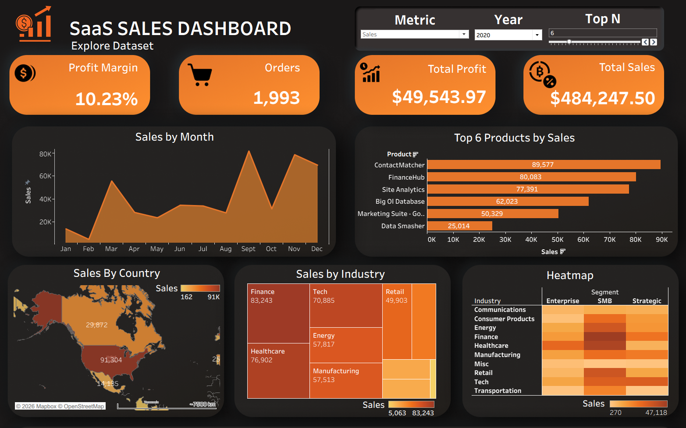
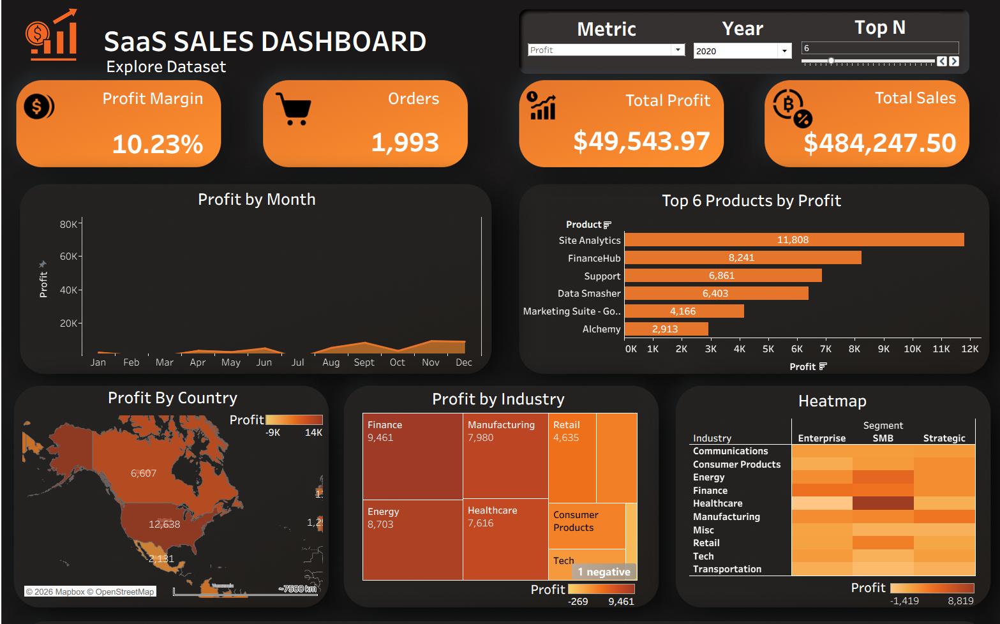
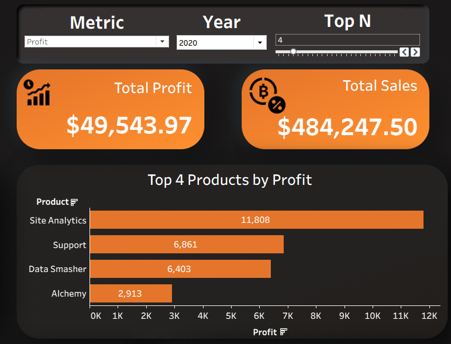

# 📊 Amazon SaaS Sales Dashboard (Tableau)

An interactive data visualization project built using **Tableau** to analyze Amazon SaaS sales data. The dashboard transforms raw sales data into meaningful insights using dynamic filters, parameters, and highlight actions. The visual design is enhanced using a custom background created in **Figma**.

---

## 🚀 Project Overview

This project explores SaaS sales performance on Amazon through a highly interactive and dynamic dashboard. The goal is to allow users to explore data like a **live analytical tool**, rather than a static report.

Instead of fixed visuals, this dashboard behaves like a system where metrics, charts, and labels adapt based on user input. This makes it easier to analyze performance trends, compare categories, and identify key business insights without working directly with raw data.

👉 This dashboard is designed to help decision-makers quickly identify high-performing products, optimize sales strategy, and understand trends without requiring raw data analysis.

---

## ✨ Key Features (What I’m Most Proud Of)

### 🔄 Fully Dynamic Metric Switching (Core Highlight)

* A **parameter-driven system** allows switching between:

  * Sales
  * Profit
  * Quantity
* All charts in the dashboard update instantly based on the selected metric
* Not only values, but overall comparisons and visual behavior change dynamically

👉 This effectively turns one dashboard into multiple analytical perspectives.

---

### 📊 Dynamic Titles & Axis Labels

* Graph **titles automatically update** based on selected metric (Sales / Profit / Quantity)
* Even **axis labels change dynamically**, ensuring full context clarity
* The dashboard always reflects the currently selected metric without confusion

👉 This makes the dashboard self-explanatory and context-aware.

---

### 🔝 Top N Analysis Control

* A **custom Top N parameter** allows users to control how many top-performing items are displayed
* Works across categories and products dynamically
* Helps focus on high-impact insights instead of cluttered full datasets

---

### 📅 Time-Based Filtering

* Year filter enables analysis across different time periods
* Supports trend analysis and yearly performance comparison

---

### 🎯 Interactive Dashboard Elements

* Filters for slicing data (country, industry, etc.)
* Highlight actions for better visual pattern recognition
* Cross-filtering between charts for connected exploration

---

## 🎨 Visual Design

* Custom dashboard background designed in **Figma**, inspired by neumorphism
* Clean and structured layout for better analytical readability
* Consistent visual hierarchy for professional dashboard presentation

---

## 📌 Insights Covered

* Key KPI summary (Sales, Profit, Quantity)
* Sales, Profit, and Quantity performance trends
* Category-wise and product-wise comparisons
* Top-performing and low-performing segments
* Time-based (yearly) performance shifts
* Dynamic ranking via Top N analysis

---

## 🛠️ Tools & Technologies Used

* **Tableau** – Core dashboard development and interactivity
* **Figma** – UI background and visual design
* **Kaggle Dataset** – Amazon SaaS Sales dataset
  🔗 [https://www.kaggle.com/datasets/nnthanh101/aws-saas-sales](https://www.kaggle.com/datasets/nnthanh101/aws-saas-sales)

---

## 📷 Dashboard Preview

### 🖼️ Dashboard Background





---

### 📊 Main Dashboard Views

#### Home Dashboard



#### Profit Filter View



#### Top N Analysis



---

## 🧠 What I Learned

* Building **parameter-driven dynamic dashboards**
* Creating adaptive visualizations that change contextually
* Implementing dynamic titles and axis logic in Tableau
* Designing dashboards that behave like interactive analytical products
* Combining UI/UX design (Figma) with data storytelling (Tableau)

---

## 📂 Project Structure

```bash
📁 Amazon-SaaS-Sales-Dashboard
 ┣ 📊 Tableau Workbook (.twbx)
 ┣ 🖼️ images/ (backgrounds + screenshots)
 ┣ 📷 dashboard screenshots
 ┗ 📄 README.md
```

---

## ⚡ Final Note

This project goes beyond static visualization and behaves like an **interactive analytics system**. Every element—from metrics to labels—adapts based on user input, making exploration intuitive, flexible, and insight-driven.

